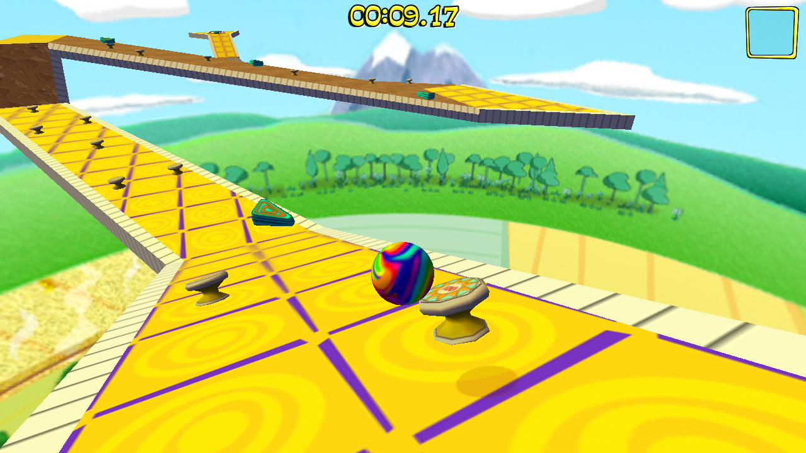

# Marble Blast Gold - Web Port
This project is a complete web port of the 3D platformer game Marble Blast Gold by GarageGames, implemented in TypeScript.

Play it here: https://marbleblast.vani.ga/ (Hoping the link will still work)

## Features
In this game, the objective is to roll your marble to the finish pad in the fastest time possible, while avoiding hazards and collecting gems and power-ups. It includes all 100 levels of the original (24 beginner, 24 intermediate, 52 advanced), as well as all gameplay elements and mechanics, sounds, music and UI/menu elements.

## Screenshots

## Technical overview
The game is implemented in TypeScript and utilizes [three.js](https://github.com/mrdoob/three.js/) for rendering and [OimoPhysics](https://github.com/saharan/OimoPhysics) as its physics engine. Its levels and assets weren't rebuilt from scratch; instead, they are read and imported from .dif, .dts and .mis files used internally by the Torque 3D Engine, on which the original game runs. All the game's internal logic was implemented from scratch, however. The physics were tuned to feel as close to the original as possible, but obviously there are still small differences. Resources are lazily loaded over the network when required for levels, making the initial load time of the website relatively short (about 4 MB). The UIs are all implemented in plain HTML and CSS, and simple persistence is provided by localStorage.

## Building
If you wish to build the game yourself, simply clone the repository, then run `npm install` and `npm run compile`, which will compile the TypeScript code using [rollup](https://rollupjs.org/guide/en/). If you wish to bundle the project, run `npm run bundle`, which uses [Sarcina](https://github.com/Vanilagy/Sarcina).

## Notes
The current version only runs on the newest versions of Chromium-based browsers and Firefox. Special thanks to the maintainers of [three.js](https://github.com/mrdoob/three.js/) and [OimoPhysics](https://github.com/saharan/OimoPhysics) for making this project possible! The gameplay itself wasn't my idea at all and I highly recommend you check out GarageGames's original version, as well as the game's community, here: https://marbleblast.com/