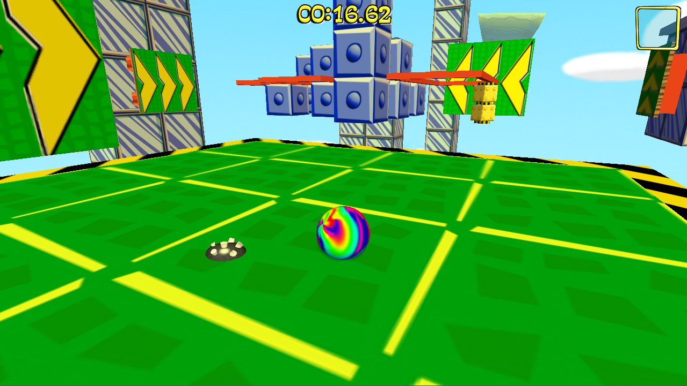
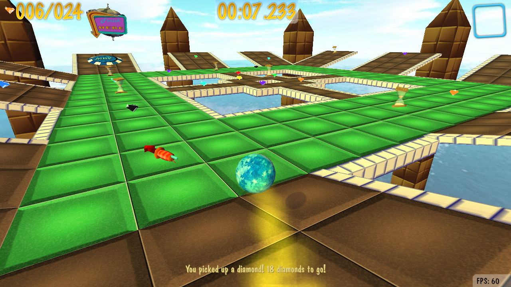
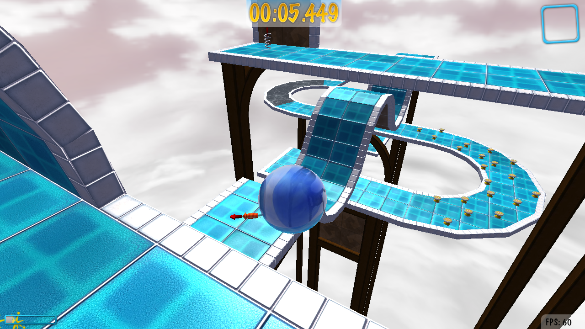
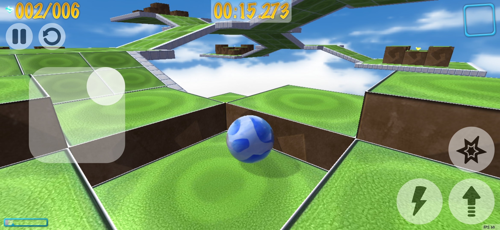
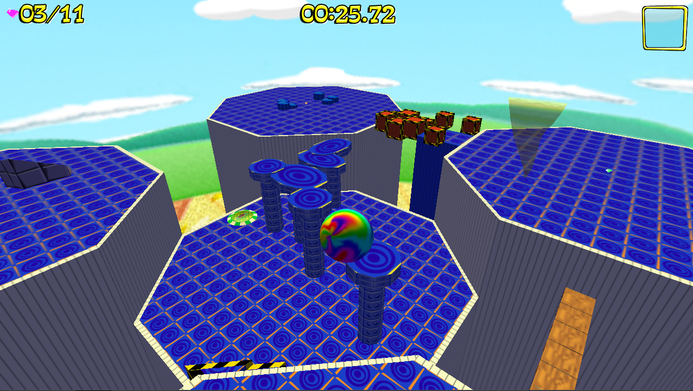
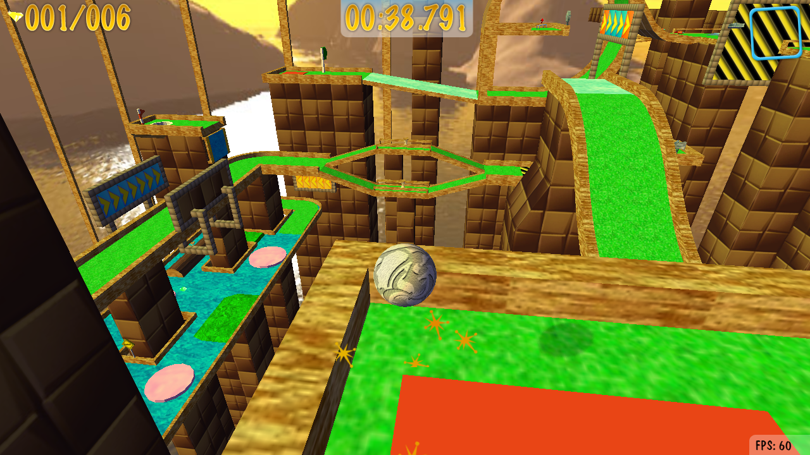
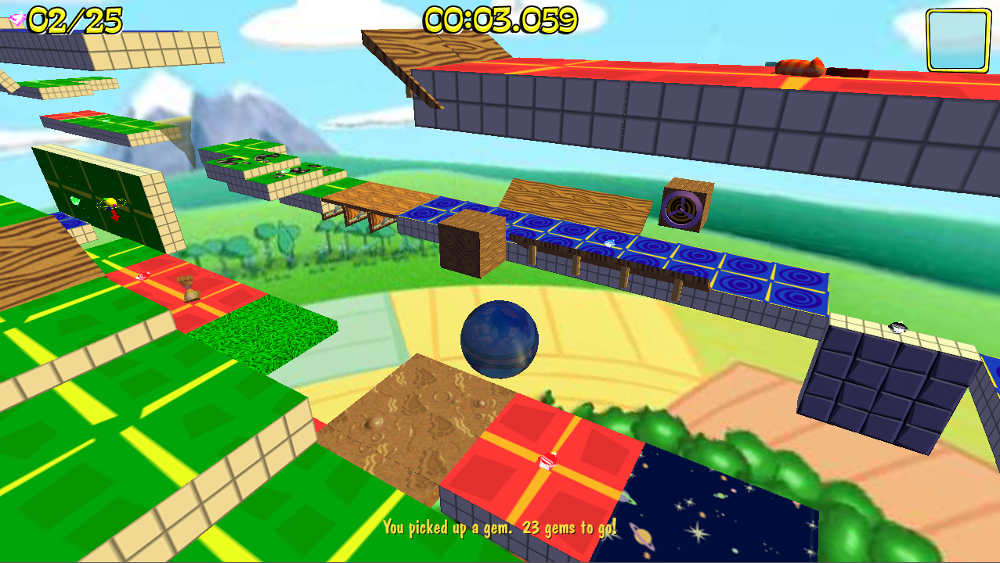
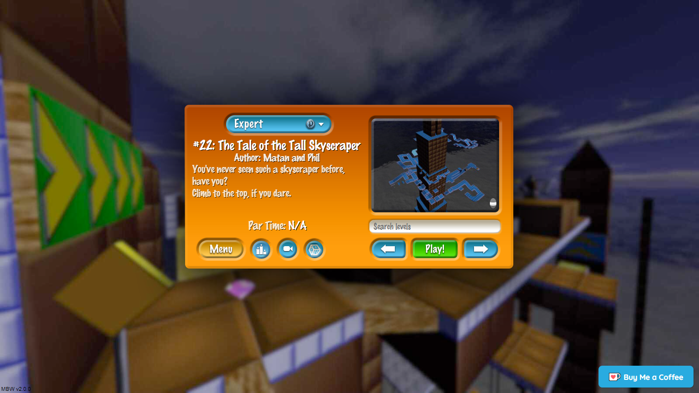
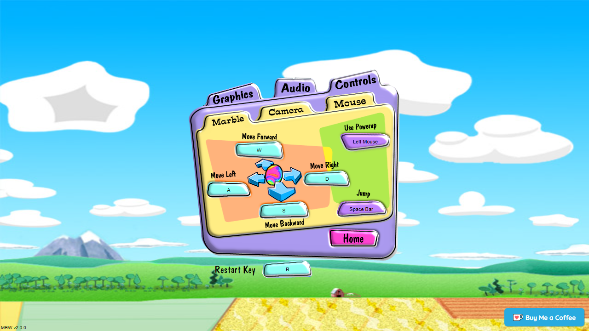

# Marble Blast Web
This project is a clean-room web port of the 3D platformer games Marble Blast Gold and Marble Blast Platinum (including Marble Blast Ultra), implemented in TypeScript.

Play it here: https://marbleblast.vaniverse.io/ 
TAS Rewind version here: https://github.com/RandomityGuy/MBG-Web-Rewind

## Features
In this game, the objective is to roll your marble to the finish pad in the fastest time possible, while avoiding hazards and collecting gems and power-ups. It includes almost 4000 levels, including 220 original MBG/MBP/MBU levels (69 beginner, 79 intermediate, 108 advanced, 25 expert) and more than 3900 community custom levels. It implements all gameplay elements, sounds, music and UI/menu components from both Marble Blast Gold, Platinum and Ultra - additional features include a replay system and online leaderboards. The two games (Gold/Platinum) can be switched between seamlessly and without reloading in the main menu. The game can be played using a keyboard, mouse, gamepad or on your mobile device.

[View version history](https://github.com/Vanilagy/MarbleBlast/blob/master/version_history.md)

## Screenshots

## Technical overview
The game is fully implemented in TypeScript and utilizes its own custom rendering and physics engine. Its levels and assets weren't rebuilt from scratch; instead, they are read and imported from .dif, .dts and .mis files used internally by the Torque 3D Engine, on which the original game runs. All the game's internal logic was implemented from scratch, however. The physics simulation runs at a fixed rate of 120 Hz and utilizes continuous collision detection - it was tuned to feel like a Marble Blast game, but there are still differences in the physics, because of which times in this game shouldn't be compared to those in the original. Resources are lazily loaded over the network when required for levels, making the initial load time of the website relatively short. The UIs are all implemented in plain HTML and CSS, and local persistence for settings, scores and replays is provided by IndexedDB. The game features a state-based replay system which guarantees deterministic playback - replays are compressed using [pako](https://github.com/nodeca/pako) and stored locally. Custom levels are supplied by [Marbleland](https://github.com/Vanilagy/Marbleland) and are cached on the server. The backend itself is implemented using Node.js and mostly handles resource loading and leaderboard updates. An SQLite database is used to store online scores. The built-in video renderer is implemented using the WebCodecs API and [my own multiplexing library](https://github.com/Vanilagy/webm-muxer).

## Building and developing
If you wish to build the game yourself, simply clone the repository, then run `npm install --legacy-peer-deps` and `npm run compile`, which will compile the TypeScript code using [rollup](https://rollupjs.org/guide/en/). Then run `npm start` to start up the server (runs on :8080 by default). If you want to configure the port and other server options, modify `server/data/config.json`. For fast development run `npm run watch-fast` (or `npm run watch` for a slower, but typechecked version). If you wish to bundle the project, run `npm run bundle`, which uses [Sarcina](https://github.com/Vanilagy/Sarcina) and writes to `dist/`.

**Note:** This project has a dependency that requires `node-gyp`. Install `node-gyp` _before_ running `npm install` on this project with `npm install -g node-gyp`, and if you're on Windows, make sure to run `npm install --global --production windows-build-tools` right afterwards in an _elevated command prompt_ (one with admin rights) to handle the annoying installation stuff.

## Notes
The current version only runs on the newest versions of Chromium-based browsers, Firefox and Safari, both on desktop and on mobile. Android support should be top-notch, and Safari is as best as it can be given Apple's restrictive PWA features on iOS. Older versions of this project utilized [three.js](https://github.com/mrdoob/three.js/) for rendering and [OimoPhysics](https://github.com/saharan/OimoPhysics) for physics - without them, this project wouldn't even exist. Additional thanks to the maintainers of [pako](https://github.com/nodeca/pako) and [jszip](https://github.com/Stuk/jszip) for making other parts of this project possible, as well as to [Jeff](https://github.com/JeffProgrammer), [RandomityGuy](https://github.com/RandomityGuy) and [Whirligig](https://github.com/Whirligig231) for helping me out with parts of the code, and to the entire Marble Blast community for their feedback and support. The gameplay itself wasn't my idea at all and I highly recommend you check out GarageGames's original version of Marble Blast Gold, as well as the game's community, here: https://marbleblast.com/
